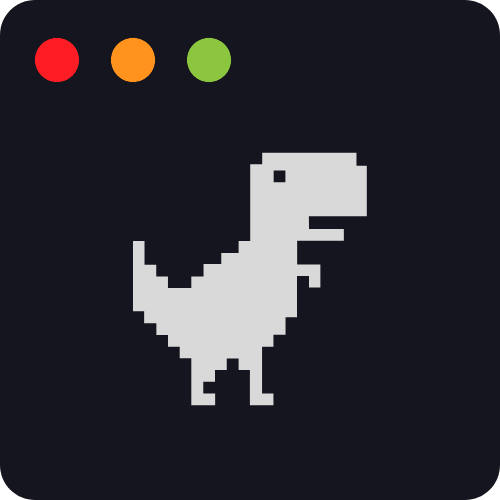

<div align="center">
  <a href="https://sse-icons.github.io/template/" target="_blank">
    
  </a>
  <h1>SSE Icons</h1>
</div>

<div align="center">
  <div>
    <a href="https://astro.build/" target="_blank">
      
    </a>
    <a href="https://tailwindcss.com/" target="_blank">
      
    </a>
    <a href="https://react.dev/" target="_blank">
      
    </a>
    <a
      href="https://github.com/sse-icons/template/releases"
      target="_blank"
    >
      
    </a>
    <a
      href="https://github.com/sse-icons/template/blob/main/LICENSE"
      target="_blank"
    >
      
    </a>
  </div>
  <div>
    <a href="https://www.npmjs.com/package/@sse-icons/template" target="_blank">
      
    </a>
    <a
      href="https://github.com/sse-icons/template/stargazers"
      target="_blank"
    >
      
    </a>
    <a
      href="https://github.com/sse-icons/template/stargazers"
      target="_blank"
    >
      
    </a>
  </div>
</div>

<p align="center">
  <a href="https://sse-icons.github.io/template/">
    Homepage
  </a>
  <span>&nbsp;⬥&nbsp;</span>
  <a href="https://sse-icons.github.io/template/icons/All">
    Browse Icons
  </a>
  <span>&nbsp;⬥&nbsp;</span>
  <a href="https://www.npmjs.com/package/@sse-icons/template">
    NPM Package
  </a>
  <span>&nbsp;⬥&nbsp;</span>
  <a href="https://sse-icons.github.io/template/docs/usageGuide/">
    Usage
  </a>
  <span>&nbsp;⬥&nbsp;</span>
  <a href="https://sse-icons.github.io/template/docs/contributing/">
    Contributing
  </a>
</p>

<p align="center">
  
</p>

Welcome to **`sse-icons`**—a curated set of high-quality, customizable tech icons built for developers and designers. Fully compatible with TypeScript, ideal for React and Next.js, or downloadable from our [official website](https://sse-icons.github.io/template/icons/All "Developer Icons Website") for design projects.

## 🚀 Tech Stack

- [Astro](https://astro.build/) - The web framework for content-driven websites.
- [React](https://reactjs.org/) - A JavaScript UI library used with Astro.
- [Tailwind CSS](https://tailwindcss.com/) - A utility-first CSS framework for rapid UI development.
- [NPM](https://www.npmjs.com/) - The package manager for JavaScript.
- [Typescript](https://www.typescriptlang.org/) - A statically typed, superset of JavaScript.
- [Vite](https://vitejs.dev/) - A lightning-fast build tool for an optimized development experience.
- [Lucide Icons](https://lucide.dev/) - A modern, customizable, open-source icon library.
- [SVGO](https://github.com/svg/svgo) - A powerful tool for compressing and optimizing SVG files.
- [SVGSON](https://github.com/svgson/svgson) - A tool to seamlessly convert SVGs to JSON format and back.

## 🌟 Features

- ⚡ **Highly optimized:** Icons are optimized for performance and size. They are designed to be as small as possible while maintaining the quality.
- 🎨 **Customizable:** Cusomizations are available for all icons. You can change the size, color, stroke width, and much more.
- 🔍 **Perfectly scalable:** Icons are designed to be properly scaled to any size without compromising the quality.
- 🔄 **Consistent icons:** No more dealing with inconsistent styles and designs. All icons are designed with a pre-defined set of rules.
- 🌗 **Various variants:** Icons come with their own set of families such as light and dark mode, wordmark, and other variants.
- ⭐ **Free & open-source:** Completely free and open-source with license. No need to worry about privately hidden malicious code and be a contributor yourself.

Explore more and start using `sse-icons` today to enhance your projects with stunning, customizable icons!

## 📦 Installation

To add the icons to your project, run one of the following commands:

```bash
npm i @sse-icons/template
```

or

```bash
yarn add @sse-icons/template
```

or

```bash
pnpm add @sse-icons/template
```

## ⚙️ Usage

Import named icon components from the `@sse-icons/template` package and use them just like any other React component, with props/attributes similar to those of an SVG:

```javascript
import { AppleDark, Auth0 } from "@sse-icons/template";

//inside your React component JSX
export const YourReactComponent = () => {
  return (
    <div>
      <AppleDark className="apple-icon" />
      <Auth0 size={52} style={{ marginLeft: 20 }} />
    </div>
  );
};
```

In this example, we import `AppleDark` and `Auth0` from the `@sse-icons/template` package and use them within a React component. You can customize the icons by adjusting their `size`, `color`, `style`, and other properties.

## 🤝 Contributing

We welcome contributions of all kinds, whether you're looking to add new icons, improve existing ones, or enhance the overall project. To get started, refer to our [Contributing Guidelines](https://sse-icons.github.io/template/docs/contributing).

## 📜 License

Licensed under MIT License and copyrights reserved.

For complete documentation, visit our [official documentation](https://sse-icons.github.io/template/docs).
